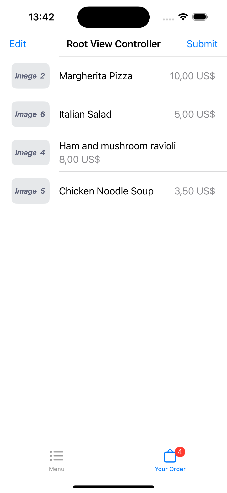

#  OrderApp

This app for order food from restaurant. You can choose dishes what you want and then you get total coast and cooking time.
All data fetched from local server. Layout made in Storyboard.

 

 

